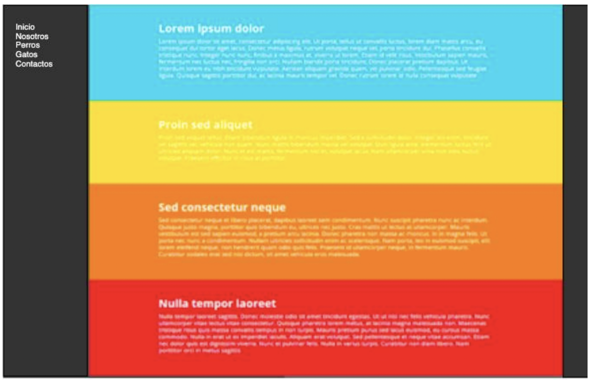

# Actividad 2

- Crear página HTML
- Crear Hoja de estilo y asociar a página HTML
- Requerimientos

  - La página web tiene una fuente del tipo sans-serif
  - al pasar el ratón sobre las opciónes del menú, este debe cambiar levemente su tono.
  - El menú tiene dos partes que se diferencian entre si por el color de los elementos.
  - El área del menú deberá ser un 20% del total del tamaño de la página.
  - El 80% restante deberá contener los cuadros de colores.
  - Cada cuadro de color deberá tener una altura de 25% del total de la página.

## Resultado esperado

